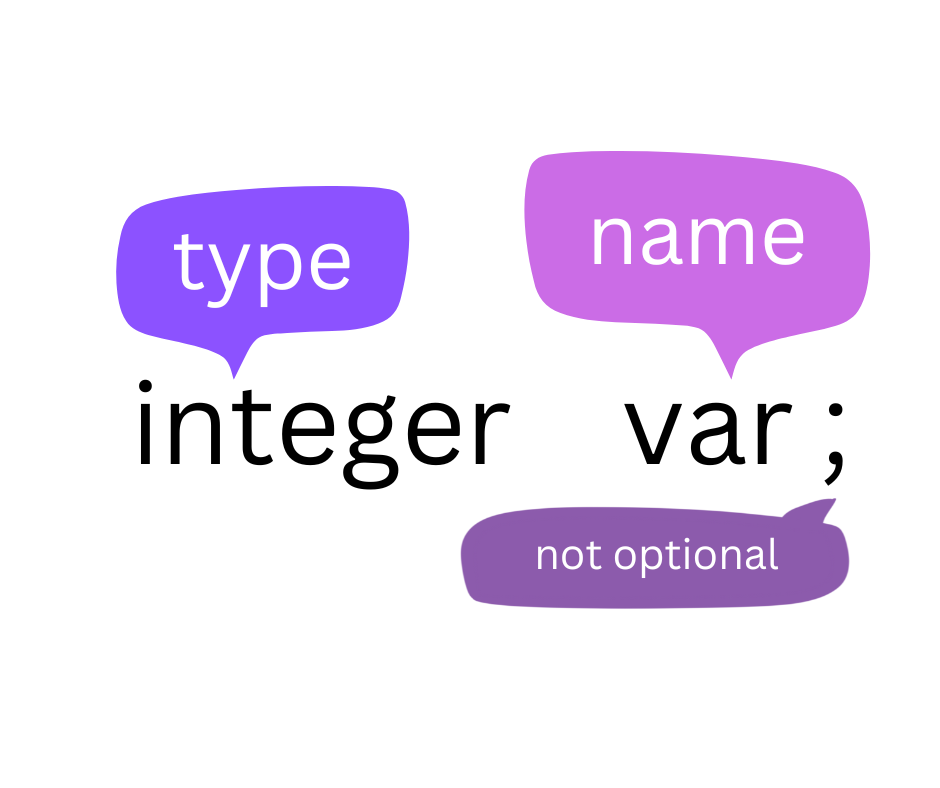
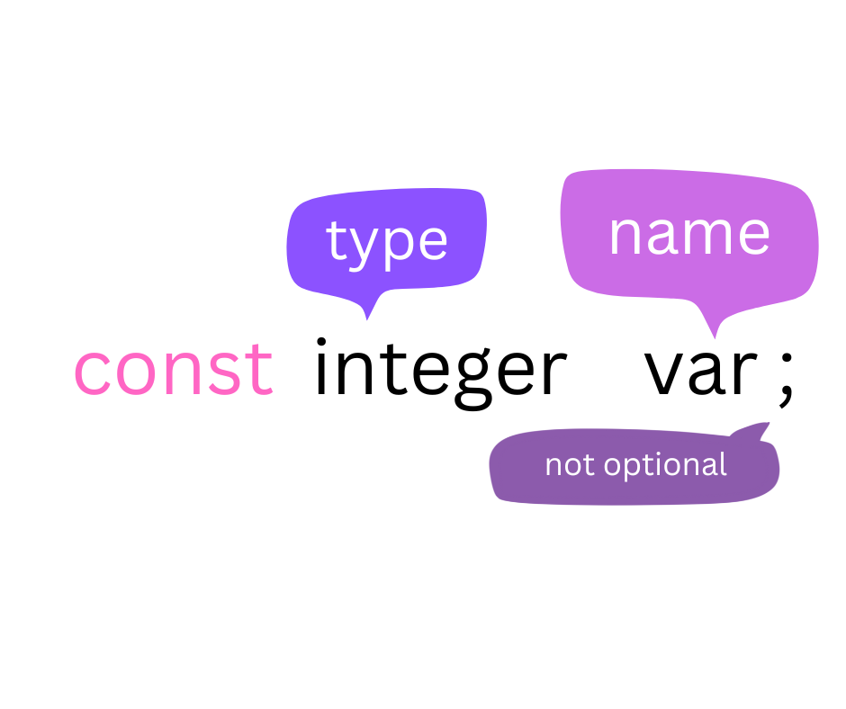
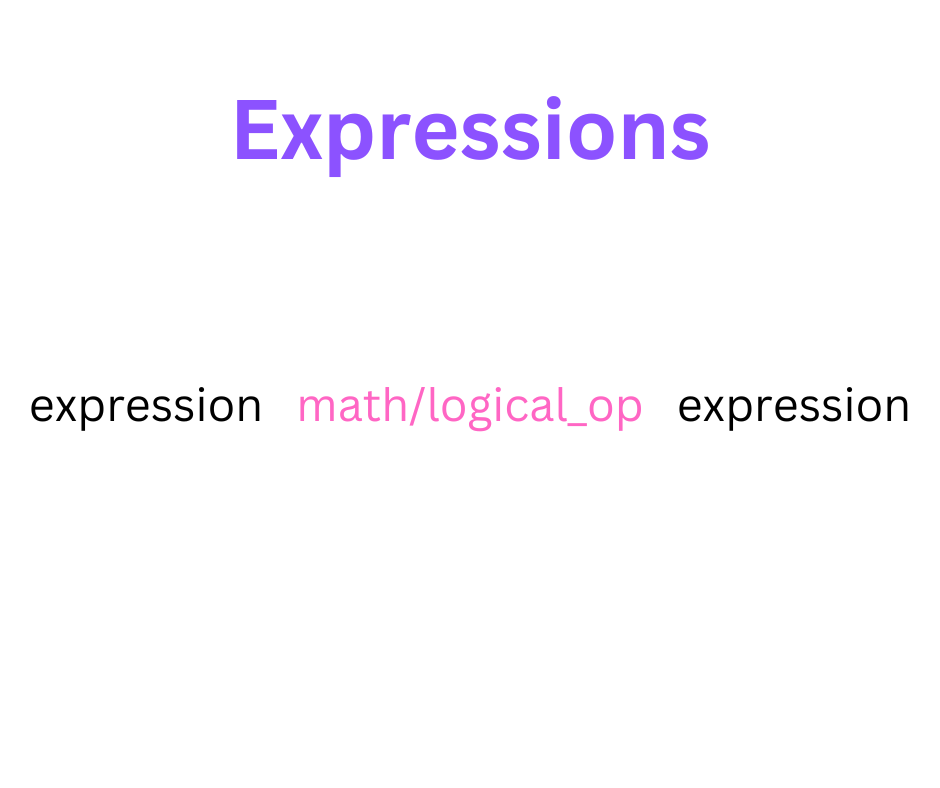
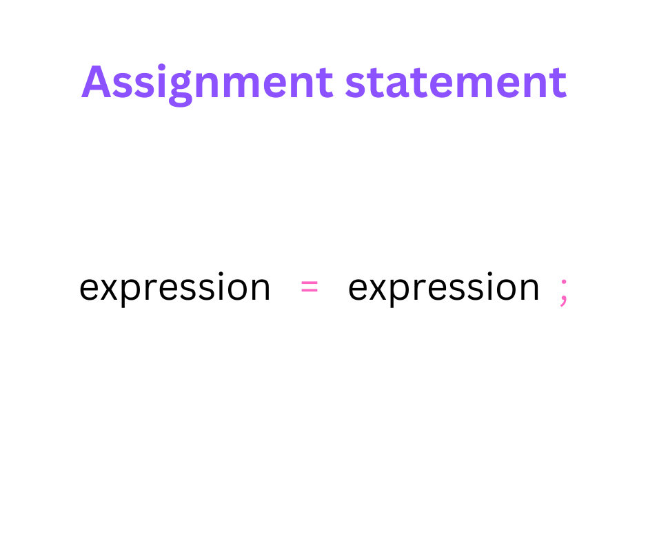

# CoDuck

<div align="center">
    
    
</div>

# Language specs

## Tokens

### types keywords

1. CHAR
2. INTEGER
3. FLOAT
4. BOOL
5. VOID

### conditional statement keywords

1. IF
2. ELIF
3. ELSE

4. CASE
5. SWITCH
6. DEFAULT
1. true (case sensitive)
1. false (case sensitive)

### loops keywords

1. WHILE
2. FOR
3. DO
4. UNTIL
5. CONTINUE
6. BREAK

### funciton keywords

1. FUNC
2. RETURN

### enums

1. ENUM

### operators

1. ADD_OP `+`
2. SUB_OP `-`
3. MUL_OP`*`
4. DIV_OP`/`
5. MOD_OP`%`
6. INC_OP`++`
7. DEC_OP`--`
8. OR_OP`||`, `or`
9. AND_OP`&&`, `and`
10. NOT_OP`!`, `not`
11. EQ_OP`==`
12. NE_OP`!=`
13. LT_OP`<`
14. GT_OP`>`
15. LE_OP`<=`
16. GE_OP`>=`
17. ASSIGN_OP`=`
18. BIT_OR_OP`|`
19. & -> for `REF` and `bitwise-and`
20. BIT_XOR_OP`^`
21. BIT_LSHIFT_OP`<<`
22. BIT_RSHIFT_OP`>>`
23. BIT_NOT_OP`~`

### symbols

1. LEFT_PAREN`(`
2. RIGHT_PAREN`)`
3. LEFT_SQ_BRACKET`[`
4. RIGHT_SQ_BRACKET`]`
5. LEFT_CURLY_BRACKET`{`
6. RIGHT_CURLY_BRACKET`}`
7. COMMA`,`
8. DOT`.`
9. SEMICOLON`;`
10. QUESTION_MARK`?`

### Other tokens

1. IDENT
2. CONST_INT
3. CONST_FLOAT
4. CONST_CHAR
5. STRING_LITERAL

## Comments

- Single line: // this is a single line comment
- Multi-line: /_ This is a Multi-line Comment _/

## Grammar design

### Declarations

#### Variables

<center>

</center>

#### Constants

<center>

</center>

### Expressions

<center>

</center>

### Assignments

<center>

</center>

### If-statement

```golang
if(expression logical_operator expression){ // the parenthesis are optional
}elif(expression logical_operator expression){// the parenthesis are optional
}else{
}
```

### Swicth...case

```c
switch (expression){ // the parenthesis are optional
    case constant1:
      // statements
      break;

    case constant2:
      // statements
      break;
    .
    .
    .
    default:
      // default statements
}
```

### while-loops

```c
while(condition){ // parenthesis are optional


}
```

### Do Until loops

```c
do{
...
}until(condition); // parenthesis are optional
```

### for-statements

```c
for(var; cond; postfix;){
// parenthesis are optional
}
```

### Block structure

| Scope                    | Meaning                                                                                                                                                                                                                                                                         |
| ------------------------ | ------------------------------------------------------------------------------------------------------------------------------------------------------------------------------------------------------------------------------------------------------------------------------- |
| File Scope               | Scope of a Identifier starts at the beginning of the file and ends at the end of the file. It refers to only those Identifiers that are declared outside of all functions. The Identifiers of File scope are visible all over the file Identifiers having file scope are global |
| Block Scope              | Scope of a Identifier begins at opening of the block / ‘{‘ and ends at the end of the block / ‘}’. Identifiers with block scope are local to their block                                                                                                                        |
| Function Prototype Scope | Identifiers declared in function prototype are visible within the prototype                                                                                                                                                                                                     |
| Function scope           | Function scope begins at the opening of the function and ends with the closing of it. Function scope is applicable to labels only. A label declared is used as a target to goto statement and both goto and label statement must be in same function                            |

### Functions

```golang

func function_name(type name, ...) return_type{
return value;
}

```

### enums

```c
enum Level {
  LOW,
  MEDIUM,
  HIGH
}

enum a{
x = 0,
y= 1
}
```

## How To Run

- to run the lexer you can run the lexer using:

```bash
flex lex.l

gcc lex.yy.c  -o lexer

.\lexer input_file
```
- to run the parser and lexer:
```bash
bison -d parser.y  // compiling parser  
flex lexer.l  // compiling lexer  
gcc -o compiler parser.tab.c lex.yy.c -lm // combining them into one file  
rm lex.yy.c parser.tab.c  // removing "garbage"  
./compiler input_file // running for "input_file"  
```
## Resources

### Phase 1

1. https://steemit.com/programming/@drifter1/writing-a-simple-compiler-on-my-own-introduction

2. https://steemit.com/programming/@drifter1/writing-a-simple-compiler-on-my-own-a-simple-c-language

3. https://steemit.com/programming/@drifter1/writing-a-simple-compiler-on-my-own-lexical-analysis-using-flex

4. https://steemit.com/programming/@drifter1/writing-a-simple-compiler-on-my-own-symbol-table-basic-structure

5. https://steemit.com/programming/@drifter1/writing-a-simple-compiler-on-my-own-using-symbol-tables-in-the-lexer

6. https://steemit.com/programming/@drifter1/writing-a-simple-compiler-on-my-own-syntax-analysis-theory (optional)

7. https://steemit.com/programming/@drifter1/writing-a-simple-compiler-on-my-own-bison-basics (all)

8. https://steemit.com/programming/@drifter1/writing-a-simple-compiler-on-my-own-creating-a-grammar-for-our-language

9. https://steemit.com/utopian-io/@drifter1/writing-a-simple-compiler-on-my-own-combine-flex-and-bison

10. https://steemit.com/utopian-io/@drifter1/writing-a-simple-compiler-on-my-own-passing-information-from-lexer-to-parser

11. https://steemit.com/utopian-io/@drifter1/writing-a-simple-compiler-on-my-own-finishing-off-the-grammer-parser-part-1

12. https://steemit.com/utopian-io/@drifter1/writing-a-simple-compiler-on-my-own-finishing-off-the-grammar-parser-part-2-c-flex-bison

### Phase 2

13. https://steemit.com/utopian-io/@drifter1/writing-a-simple-compiler-on-my-own-semantic-analysis-theory-c-flex-bison

14. https://steemit.com/utopian-io/@drifter1/writing-a-simple-compiler-on-my-own-semantics-examples-c-flex-bison

15. https://steemit.com/utopian-io/@drifter1/writing-a-simple-compiler-on-my-own---scope-resolution-using-the-symbol-table-cflexbison

16. https://steemit.com/utopian-io/@drifter1/writing-a-simple-compiler-on-my-own-type-declaration-and-checking-c-flex-bison

17. https://steemit.com/utopian-io/@drifter1/writing-a-simple-compiler-on-my-own-function-semantics-part-1-c-flex-bison

18. https://steemit.com/utopian-io/@drifter1/writing-a-simple-compiler-on-my-own-function-semantics-part-2-c-flex-bison

19. https://steemit.com/utopian-io/@drifter1/writing-a-simple-compiler-on-my-own-abstract-syntax-tree-principle-c-flex-bison

20. https://steemit.com/utopian-io/@drifter1/writing-a-simple-compiler-on-my-own-abstract-syntax-tree-structure-c-flex-bison

21. https://steemit.com/utopian-io/@drifter1/writing-a-simple-compiler-on-my-own-abstract-syntax-tree-management-c-flex-bison

22. https://steemit.com/utopian-io/@drifter1/writing-a-simple-compiler-on-my-own-action-rules-for-declarations-and-initializations-c-flex-bison

23. https://steemit.com/utopian-io/@drifter1/writing-a-simple-compiler-on-my-own-action-rules-for-expressions-c-flex-bison

24. https://steemit.com/utopian-io/@drifter1/writing-a-simple-compiler-on-my-own-action-rules-for-expressions-c-flex-bison

25. https://steemit.com/utopian-io/@drifter1/writing-a-simple-compiler-on-my-own-action-rules-for-assignments-and-simple-statements-c-flex-bison

26. https://steemit.com/utopian-io/@drifter1/writing-a-simple-compiler-on-my-own-action-rules-for-if-else-statements-c-flex-bison

27. https://steemit.com/utopian-io/@drifter1/writing-a-simple-compiler-on-my-own-action-rules-for-loop-statements-and-some-fixes-c-flex-bison

28. https://steemit.com/utopian-io/@drifter1/writing-a-simple-compiler-on-my-own-action-rules-for-function-declarations-part-1-c-flex-bison

29. https://steemit.com/utopian-io/@drifter1/writing-a-simple-compiler-on-my-own-action-rules-for-function-declarations-part-2-c-flex-bison

30. https://steemit.com/utopian-io/@drifter1/writing-a-simple-compiler-on-my-own-action-rules-for-function-calls-c-flex-bison

31. https://steemit.com/utopian-io/@drifter1/writing-a-simple-compiler-on-my-own-datatype-attribute-for-expressions-c-flex-bison

32. https://steemit.com/utopian-io/@drifter1/writing-a-simple-compiler-on-my-own-type-checking-for-assignments-c-flex-bison

33. https://steemit.com/utopian-io/@drifter1/writing-a-simple-compiler-on-my-own-revisit-queue-and-parameter-checking-part-1-c-flex-bison

34. https://steemit.com/utopian-io/@drifter1/writing-a-simple-compiler-on-my-own-revisit-queue-and-parameter-checking-part-2-c-flex-bison

35. https://steemit.com/utopian-io/@drifter1/writing-a-simple-compiler-on-my-own-revisit-queue-and-parameter-checking-part-3-c-flex-bison

36. https://steemit.com/utopian-io/@drifter1/writing-a-simple-compiler-on-my-own-revisit-queue-and-parameter-checking-part-4-c-flex-bison

37. https://steemit.com/utopian-io/@drifter1/writing-a-simple-compiler-on-my-own-revisit-queue-and-assignment-checking-part-1-c-flex-bison

38. https://steemit.com/utopian-io/@drifter1/writing-a-simple-compiler-on-my-own-revisit-queue-and-assignment-checking-part-2-c-flex-bison

39. https://steemit.com/utopian-io/@drifter1/writing-a-simple-compiler-on-my-own-revisit-queue-and-assignment-checking-part-3-c-flex-bison

## Links

#### C Operator Precedence

https://en.cppreference.com/w/c/language/operator_precedence

#### C Grammar

http://marvin.cs.uidaho.edu/Teaching/CS445/c-Grammar.pdf
