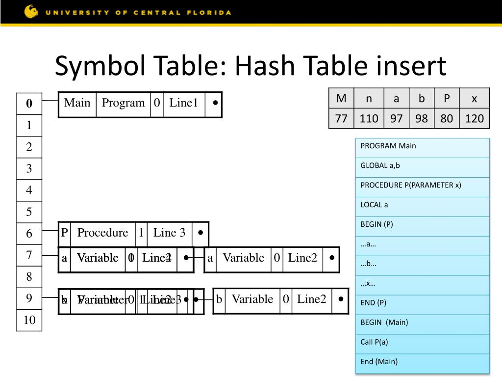

# Symbol table

our symbol table will be a hashtable with chaining method

 
 

## Hash Function

hash(name) = Σascii mod k

where k is the size of the hash table, and it should be a prime number

## Operations in symtable

1. `Insert()` -> When recognizing a new identifier we create a new entry for the symbol table if it doesn't already exist. If it already exists then we check the scope to see if it's the same variable, by adding it to the reference list if it's the same variable or creating a whole new entry if it's a new scope for a subroutine for example.

2. `Lookup()` -> Search for an identifier in the current (or any) scope and return it's ST entry, when using it in the syntax or semantic analysis.

3. `Hide()` -> "Deactivate" the variables of a specific scope (mostly the current one) when leaving a specific structural block or subroutine.
